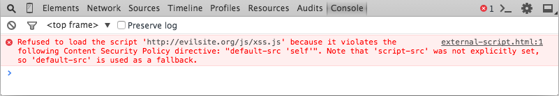

`Content Security Policy (CSP, политика защиты контента)` — это механизм обеспечения безопасности, с помощью которого
можно защищаться от атак с внедрением контента, например, межсайтового скриптинга (XSS, cross site scripting). CSP
описывает безопасные источники загрузки ресурсов, устанавливает правила использования встроенных стилей, скриптов, а
также динамической оценки JavaScript — например, с помощью eval. Загрузка с ресурсов, не входящих в «белый список»,
блокируется. Представляет собой HTTP заголовок.

С помощью директив ограничивает загрузку контента.
## Примеры

### Пример 1

Администратор веб-сайта хочет, чтобы весь контент исходил из собственного источника сайта (за исключением поддоменов).

```http request
Content-Security-Policy: default-src 'self'
```

### Пример 2

Администратор веб-сайта хочет разрешить контент из доверенного домена и всех его поддоменов (это не обязательно должен
быть тот же домен, на котором настроен CSP).

```http request
Content-Security-Policy: default-src 'self' example.com *.example.com
```

### Пример 3

Администратор веб-сайта хочет разрешить пользователям веб-приложения включать изображения из любого источника в свой
собственный контент, но ограничить доступ к аудио- и видеофайлам доверенными поставщиками, а все сценарии — только к
определенному серверу, на котором размещен доверенный код.

```http request
Content-Security-Policy: default-src 'self'; img-src *; media-src example.org example.net; script-src userscripts.example.com
```

Здесь по умолчанию содержимое разрешено только из источника документа со следующими исключениями:

* Изображения могут загружаться откуда угодно (обратите внимание на подстановочный знак «*»).
* Медиа разрешены только с example.org и example.net (а не с субдоменов этих сайтов).
* Исполняемый скрипт разрешен только с userscripts.example.com.

### Пример 4

Администратор веб-сайта онлайн-банкинга хочет убедиться, что весь его контент загружается с использованием TLS, чтобы
предотвратить прослушивание запросов злоумышленниками.

```http request
Content-Security-Policy: default-src https://onlinebanking.example.com
```

Сервер разрешает доступ только к документам, загружаемым специально через HTTPS через единственный источник
onlinebanking.example.com.

### Пример 5

Администратор веб-сайта веб-почты хочет разрешить HTML в электронной почте, а также изображения, загружаемые из любого
места, но не JavaScript или другой потенциально опасный контент.

```http request
Content-Security-Policy: default-src 'self' *.example.com; img-src *
```

Обратите внимание, что в этом примере не указывается script-src; с примером CSP этот сайт использует настройку,
указанную в директиве default-src, что означает, что скрипты могут быть загружены только с исходного сервера.

## Примеры нарушения CSP
1) 

2) 

3) 

## Логирование

Как уже упоминалось, сообщения обо всех нарушениях политики безопасности логгируются в консоли браузера. Это удобно,
пока вы только разрабатываете сайт, но после развёртывания нужен более практичный способ получения отчётов о нарушениях.
Для этого можно использовать директиву `report-uri`. Каждый раз, когда регистрируется нарушение CSP, директива отправляет
на указанный адрес запрос HTTP POST. В теле запроса содержится JSON-объект, в котором указаны все необходимые
подробности.